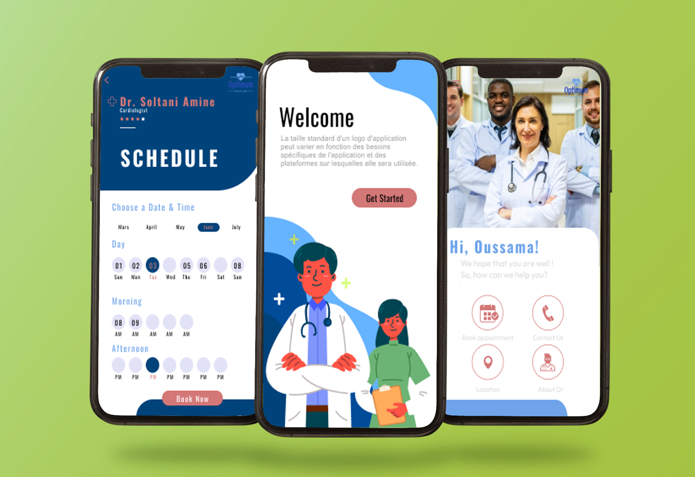

  

# optimum

To start wokring please do this following steps : 
- Clone the repository.
- Navigate to the project directory.
- Change to the client folder using the command "cd Projet".
- Create your branch by do this following command : "git checkout -b "YourName/YourTask"
- To confirm that you are in your branch do this following commande : "git branch". Your branch should be highlighted in a different color than the other branches.
- You can now work on your local branch. When you are ready to push your changes, follow these steps:
-           -- Use the command "git add *" to stage your changes.
-           -- Use the command "git commit -m "message or comment"" to commit your changes with a message.
-           -- Use the command "git push origin YourName/YourTask" to push your changes to the remote repository.
- The changes should now be updated on the remote repository.
- now you can now delete the branch created by do this 2 commandes : "git checkout main" for move to the main branch, than "git branch -d "YourName/YourTask""
- Sometimes, you may need to use the "pull" command to refresh your local files.

